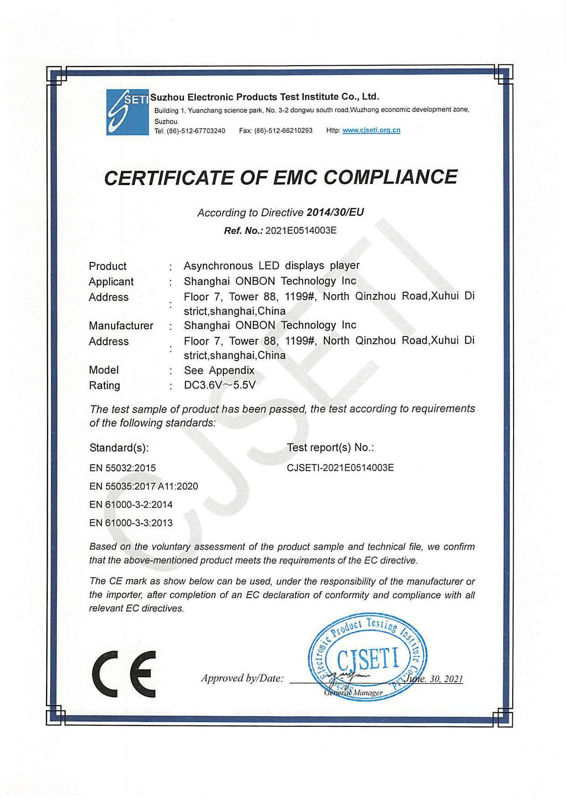

# Quality Guarantee

At OnbonBX, we strive to ensure the highest level of quality for all of our products in order to satisfy the needs and expectations of our clients. Each electronic LED screen control device that comes from our production facilities undergoes a meticulous quality assurance process and adheres to international, industrial, and sector-specific standards.

## ISO 9001

Compliance with International Quality Standards. Our devices meet high international quality standards, such as ISO 9001, which confirms our commitment to continuous improvement in production processes and delivering quality products.

## CE

CE Certification (Conformité Européenne). Each of our electronic devices holds the European CE quality certification, confirming the compliance of our products with the safety, health, and environmental requirements established by the European Communities.

|             CE Certificate of EMC compliance OVP             |         CE Certificate of EMC compliance BX-V, BX-i          |            CE Certificate of EMC compliance BX-Y             |           CE Certificate of EMC compliance BX-6, X           |
| :----------------------------------------------------------: | :----------------------------------------------------------: | :----------------------------------------------------------: | :----------------------------------------------------------: |
| { loading=lazy } | { loading=lazy } | {  loading=lazy } | { loading=lazy } |

## CCC

Chinese CCC Certification (China Compulsory Certification). Our products also undergo mandatory Chinese CCC certification, ensuring compliance with quality and safety standards applicable in China.

|      |                     OVP CCC certificate                      |      |
| :--: | :----------------------------------------------------------: | :--: |
|      | { loading=lazy, width="35%" } |      |

## RoHS

Compliance with RoHS requirements. We prioritize the environment and the health of our clients, which is why all of our products adhere to RoHS (Restriction of Hazardous Substances) requirements. This means that our production excludes hazardous substances, such as lead, mercury, cadmium, and other harmful materials that could potentially harm health and the environment.

|      |                       RoHS certificate                       |                RoHS certificate devices list                 |      |
| :--: | :----------------------------------------------------------: | :----------------------------------------------------------: | :--: |
|      | { loading=lazy } | {  loading=lazy } |      |

## Industry Standards

OnbonBX is actively involved and a founding contributor to numerous industry standards, allowing our products to meet the highest requirements. For instance, standards like "T/COEMA 102S-2018: General Technical Requirements for Asynchronous LED Controller (Board) without Grayscale" and "T/COEMA 103S-2019: General Technical Requirements for Asynchronous Full-Color LED Player" are clear manifestations of our dedication to establishing quality standards in the field.

These industry standards not only define the technical specifications of our products but also set parameters for performance, necessary interfaces, core and additional functions, adaptability to the environment, cloud service capabilities, and much more. This demonstrates our commitment to ensuring the highest quality, user-friendliness, and cutting-edge capabilities for our clients.

Our involvement in setting and adhering to industry standards is yet another assurance that OnbonBX products will consistently align with advanced technological and quality standards in the LED screen control field.

|      |                      T/COEMA 102S-2018                       |                      T/COEMA 103S-2019                       |      |
| :--: | :----------------------------------------------------------: | :----------------------------------------------------------: | :--: |
|      | { loading=lazy } | {  loading=lazy } |      |

## Internal Testing

Ensuring product compliance with corporate standards and rigorous internal quality testing are key components of our approach to achieving the highest level of reliability and performance for all electronic LED screen control devices produced by OnbonBX.

All aspects of production, from design to manufacturing, undergo meticulous control according to our corporate norms and quality standards. Each device undergoes careful scrutiny and testing at various stages of production to identify and rectify potential defects.

At our manufacturing facility, specialized testing benches are equipped to conduct simulated testing of products under various conditions, including climatic, electromagnetic, and mechanical factors. Each device undergoes these tests to verify its resilience and functionality in real-world usage scenarios.

## Conclusion

We take pride in the high quality of our products and believe that they will meet your needs and exceed your expectations. Our team of professionals and engineers is always available to provide you with technical support, answer your questions, and assist you in resolving any issues related to our products. Our approach guarantees the highest level of reliability and performance for each electronic device for LED screen control that comes from our company.

With us, you can be confident in the quality, reliability, and safety of our electronic devices for LED screen control. Thank you for choosing OnbonBX!