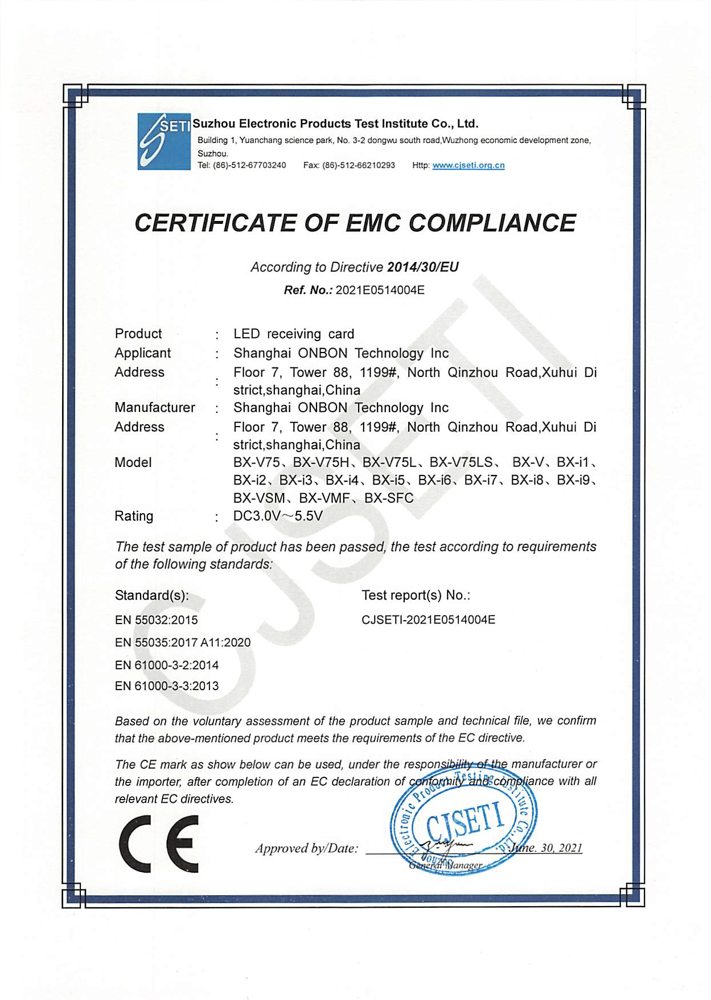
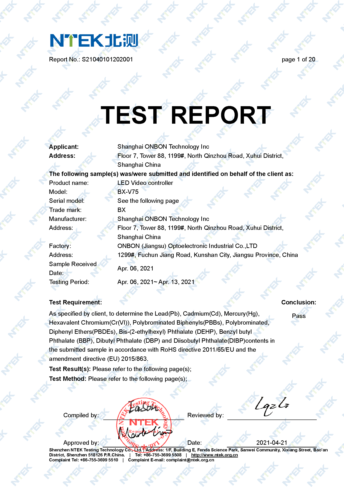

# Гарантія якості

У компанії OnbonBX ми прагнемо забезпечити найвищий рівень якості усієї нашої продукції з метою задоволення потреб і очікувань наших клієнтів. Кожен електронний пристрій керування світлодіодним екраном, що виходить з наших виробничих потужностей, проходить ретельний процес гарантії якості та відповідає міжнародним, промисловим та галузевим стандартам.

## ISO 9001

Відповідність міжнародним стандартам якості. Наші пристрої відповідають високим міжнародним стандартам якості, таким як ISO 9001, який підтверджує наше зобов'язання до постійного удосконалення процесів виробництва та надання якісних продуктів.

## CE

Сертифікація CE (Conformite Europeenne). Кожний наш електронний пристрій має Європейський сертифікат якості CE, що підтверджує відповідність нашої продукції вимогам безпеки, здоров'я та навколишнього середовища, які встановлені Європейськими спільнотами.

|             CE Certificate of EMC compliance OVP             |         CE Certificate of EMC compliance BX-V, BX-i          |            CE Certificate of EMC compliance BX-Y             |           CE Certificate of EMC compliance BX-6, X           |
| :----------------------------------------------------------: | :----------------------------------------------------------: | :----------------------------------------------------------: | :----------------------------------------------------------: |
| { loading=lazy } | { loading=lazy } | {  loading=lazy } | { loading=lazy } |

## CCC

Китайська сертифікація CCC (China Compulsory Certification). Наша продукція також проходить обов'язкову Китайську сертифікацію CCC, що гарантує відповідність стандартам якості та безпеки, які чинні в Китаї.

|      |                     OVP CCC certificate                      |      |
| :--: | :----------------------------------------------------------: | :--: |
|      | { loading=lazy, width="35%" } |      |

## RoHS

Відповідність вимогам RoHS. Ми дбаємо про навколишнє середовище та здоров'я наших клієнтів, тому всі наші продукти відповідають вимогам RoHS - Restriction of Hazardous Substances (Обмеження використання небезпечних речовин). Це означає, що наша продукція не містить небезпечних речовин, таких як свинець, ртуть, кадмій та інші шкідливі речовини, що можуть шкодити здоров'ю і довкіллю.

|      |                       RoHS certificate                       |                RoHS certificate devices list                 |      |
| :--: | :----------------------------------------------------------: | :----------------------------------------------------------: | :--: |
|      | { loading=lazy } | {  loading=lazy } |      |

## Галузеві стандарти

Компанія OnbonBX займає активну участь та є засновником численних галузевих стандартів, що дозволяє нашій продукції відповідати найвищим вимогам. Наприклад, стандарти такі як «T/COEMA 102S-2018: Загальні технічні вимоги до асинхронного світлодіодного контролера (плати) без відтінків сірого» та «T/COEMA 103S-2019: Загальні технічні вимоги до асинхронного світлодіодного повнокольорового плеєра», є чітким проявом нашої зосередженості на створенні стандартів якості у галузі.

Ці галузеві стандарти визначають не лише технічні характеристики наших продуктів, а й встановлюють параметри продуктивності, наявність необхідних інтерфейсів, основні та додаткові функції, адаптивність до навколишнього середовища, можливості хмарних послуг та багато іншого. Це свідчить про нашу відданість забезпеченню найвищої якості, зручності використання та передових можливостей для наших клієнтів.

Наша участь у встановленні та використанні галузевих стандартів є ще однією гарантією, що продукція компанії OnbonBX завжди буде відповідати передовим технологічним та якісним стандартам у галузі керування світлодіодними екранами.

|      |                      T/COEMA 102S-2018                       |                      T/COEMA 103S-2019                       |      |
| :--: | :----------------------------------------------------------: | :----------------------------------------------------------: | :--: |
|      | { loading=lazy } | {  loading=lazy } |      |

## Внутрішнє тестування

Відповідність продукції до корпоративних норм та жорстке внутрішнє тестування якості продукції є ключовими компонентами нашого підходу до забезпечення найвищого рівня надійності та продуктивності усіх електронних пристроїв керування світлодіодним екраном виробництва компанії OnbonBX.

Усі аспекти виробництва, починаючи від проєктування та закінчуючи виробництвом, піддаються ретельному контролю відповідно до наших корпоративних норм та стандартів якості. Кожен пристрій ретельно перевіряється та тестується на різних етапах виробництва з метою виявлення та усунення можливих дефектів.

На нашому виробничому підприємстві обладнані спеціалізовані стенди тестування, які дозволяють проводити імітаційне тестування продукції під впливом різноманітних чинників, таких як кліматичні, електромагнітні механічні. Кожен пристрій зазнає цих тестів для перевірки його стійкості та працездатності в умовах реального використання.

## Висновок

Ми пишаємося високою якістю своєї продукції та віримо, що вона задовольнить ваші потреби та перевищить ваші очікування. Наша команда професіоналів та інженерів завжди на зв'язку, щоб надати вам технічну підтримку, відповісти на ваші запитання та допомогти у розв'язанні будь-яких питань, пов'язаних з нашою продукцією. Наш підхід гарантує найвищий рівень надійності та продуктивності кожного електронного пристрою для керування світлодіодним екраном, що виходить зі стін нашої компанії.

З нами ви можете бути впевнені в якості, надійності та безпеці наших електронних пристроїв для керування світлодіодним екраном. Дякуємо за ваш вибір OnbonBX!