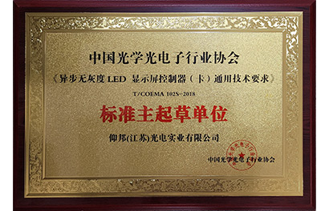
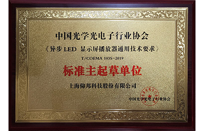

# 质量保证

在OnbonBX公司，我们努力确保所有产品的最高质量水平，以满足我们客户的需求和期望。我们生产的每个电子LED屏幕控制设备都经过精心的质量保证过程，并符合国际、工业和行业标准。

## ISO 9001

符合国际质量标准。我们的设备符合高国际质量标准，如ISO 9001，这证实了我们致力于持续改进生产流程和提供优质产品。

## CE

CE认证（Conformité Européenne）。我们的每个电子设备都持有欧洲CE质量认证，证实我们的产品符合欧洲共同体制定的安全、健康和环境要求。

|             CE Certificate of EMC compliance OVP             |         CE Certificate of EMC compliance BX-V, BX-i          |            CE Certificate of EMC compliance BX-Y             |           CE Certificate of EMC compliance BX-6, X           |
| :----------------------------------------------------------: | :----------------------------------------------------------: | :----------------------------------------------------------: | :----------------------------------------------------------: |
| { loading=lazy } | { loading=lazy } | {  loading=lazy } | { loading=lazy } |

## CCC

中国强制性产品认证（China Compulsory Certification）。我们的产品还需要进行中国强制性产品认证，确保其符合中国的质量和安全标准。

|      |                     OVP CCC certificate                      |      |
| :--: | :----------------------------------------------------------: | :--: |
|      | { loading=lazy, width="35%" } |      |

## RoHS

符合RoHS要求。我们重视环境和客户的健康，因此我们所有的产品都符合RoHS（有害物质限制）要求。这意味着我们的产品不含有害物质，如铅、汞、镉和其他可能对健康和环境造成危害的物质。

|      |                       RoHS certificate                       |                RoHS certificate devices list                 |      |
| :--: | :----------------------------------------------------------: | :----------------------------------------------------------: | :--: |
|      | { loading=lazy } | {  loading=lazy } |      |

## 行业标准

OnbonBX 积极参与并是多个行业标准的创始贡献者，使我们的产品满足最高要求。例如，"T/COEMA 102S-2018：无灰度异步LED控制器（板）的通用技术要求" 和 "T/COEMA 103S-2019：异步全彩LED播放器的通用技术要求" 等标准，清楚地表明了我们致力于在该领域建立质量标准。

这些行业标准不仅定义了我们产品的技术规格，还为性能、必要接口、核心和附加功能、环境适应性、云服务能力等设定了参数。这体现了我们确保为客户提供最高质量、用户友好性和前沿能力的承诺。

我们参与制定和遵循行业标准是对 OnbonBX 产品将始终与 LED 屏幕控制领域的先进技术和质量标准保持一致的又一保证。

|      |                      T/COEMA 102S-2018                       |                      T/COEMA 103S-2019                       |      |
| :--: | :----------------------------------------------------------: | :----------------------------------------------------------: | :--: |
|      | { loading=lazy } | {  loading=lazy } |      |

## 内部测试

确保产品符合公司标准和严格的内部质量测试是我们实现所有由OnbonBX生产的电子LED屏幕控制设备具有最高可靠性和性能的关键要素。

从设计到制造的所有生产环节都按照我们的公司规范和质量标准进行严密控制。每个设备在生产的不同阶段都经过仔细的审查和测试，以确定和纠正潜在的缺陷。

在我们的制造设施中，配备了专门的测试台，可以在各种条件下对产品进行模拟测试，包括气候、电磁和机械因素。每个设备都会经过这些测试，以验证其在实际使用场景中的弹性和功能。

## 结束语

我们为产品的高质量感到自豪，相信它们将满足您的需求并超出您的期望。我们的专业团队和工程师随时为您提供技术支持，回答您的问题，并协助您解决与我们的产品相关的任何问题。我们的方法保证了每个电子设备的最高可靠性和性能，用于控制LED屏幕，这些设备来自我们的公司。

在我们这里，您可以对我们的LED屏幕控制电子设备的质量，可靠性和安全性充满信心。感谢您选择OnbonBX！